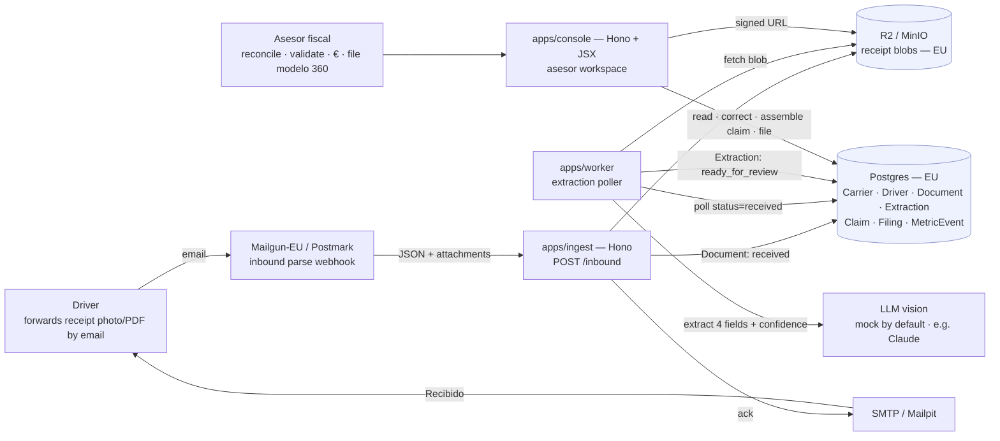
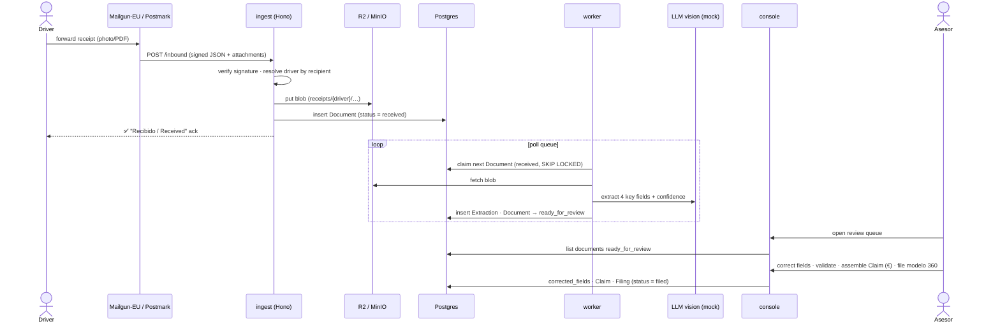
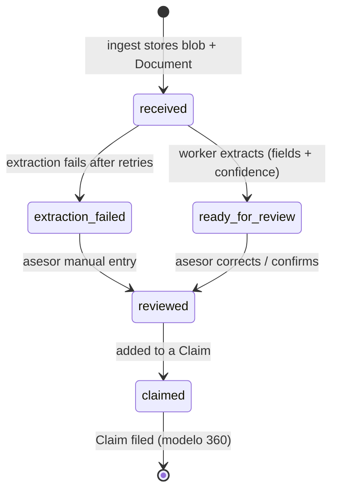

# TTR — Transport Tax Recovery

**A platform that lets individual truck drivers and small/medium EU road-freight
carriers reclaim the fuel VAT, professional-diesel excise, and cross-border
income-tax relief they are legally owed — by forwarding a photo of a receipt,
not hiring an accountant.** Billing is **no-win-no-fee**: a success fee (~15%) on
money actually recovered.

> **Status: pre-product, with a working POC.** The [`research/`](research/) dossier defines the
> opportunity, market, product and Spain-first plan; [`tasks/`](tasks/) turns the POC into scoped
> PRDs + technology research; and [`src/`](src/) + [`infra/`](infra/) now hold a **runnable POC** —
> email ingest → AI extraction → concierge review — verified end-to-end (93 unit tests + a live
> docker-compose smoke run). The two load-bearing numbers (~€6,000 recovered/truck, ~15% fee) remain
> **hypotheses the Spain pilot validates**, not proven facts.

> ℹ️ Working here as an agent or new contributor? **Read [`AGENTS.md`](AGENTS.md)
> first** — it captures the project state, the dossier conventions, and the
> editorial decisions (voice, terminology, provider-agnostic wording) to follow.

## What TTR recovers

Three stackable, legally-recoverable pools for an EU truck that crosses borders —
**≈ €6,000 per international truck per year** (before driver income-tax relief):

1. **Cross-border fuel & travel VAT** — VAT on diesel, tolls, AdBlue and repairs
   bought abroad, reclaimed through the home country's portal (EU Directive
   2008/9/EC; Spain: *modelo 360*; hard 30 September deadline).
2. **Professional-diesel excise refunds** — partial national excise refunds for
   trucks ≥ 7.5 t (FR *gazole professionnel*, ES *gasóleo profesional*, IT, BE …).
3. **Per-diem / days-abroad income-tax relief** — driver-level allowances (an
   upsell; declining under the EU Mobility Package).

## How it works

A driver forwards a photo of a receipt (WhatsApp / email / app). **Multimodal AI
extraction (OCR + vision LLMs, provider-agnostic)** plus a per-country rules
engine turn it into a validated, filing-ready claim. Filing uses Spain's
*apoderamiento* / *colaborador social* authorization and AEAT electronic
submission (file upload / web service). Humans stay in the loop until volume
justifies automation.

## The plan

**Spain first** (international-running 1–10-truck *autónomo* carriers) → prove the
two load-bearing numbers (€ recovered per truck, willingness to pay ~15%) with an
**8-week concierge pilot** → build the **MVP** (self-serve PWA + the foreign-VAT
flow) → **Platform** (multi-country, automated e-filing) → expand (Poland/Romania).

- **TAM** ≈ €10.8B recoverable / €1.6B fee across EU international trucks.
- **Spain slice** ≈ €0.85B recoverable / €130M fee (estimate).

## How the POC works

The POC keeps the dossier's **concierge** shape: software does **email ingest + AI extraction only**;
a human *asesor* reconciles, validates, computes the recoverable €, and files *modelo 360*. The
build plan lives in [`tasks/`](tasks/); the runnable code lives in [`src/`](src/) (an npm-workspaces
monorepo) and runs locally on the [`infra/`](infra/) docker-compose stack.

### Architecture



The automated pipeline **stops at extraction** (`ingest` + `worker`); everything to the right of the
`console` is a human. `@ttr/core` is the shared package (types, Postgres repos, S3 storage, the
mock/LLM extractor, email) that all three apps import.

### Runtime flow — one receipt, end to end



### Document lifecycle



### The pieces

| Piece | Package | Role |
|---|---|---|
| **Ingest** | `src/apps/ingest` (Hono) | Receives the provider webhook, verifies the signature, resolves the driver, stores blobs in R2, records `Document`s, sends the ack. Portable to a Cloudflare Worker. |
| **Extraction worker** | `src/apps/worker` | Polls `received` documents, runs the (mock / LLM-vision) extractor, writes `Extraction` + confidence, flags `extraction_failed` on repeated failure. |
| **Concierge console** | `src/apps/console` (Hono + JSX) | The asesor's workspace: review queue, correct-fields, manual reconcile/validate/€, claims + filing tracker, per-driver recovery statement, gate dashboard, backlog upload. |
| **Shared core** | `src/packages/core` | Types · Postgres repos · S3 storage · mock+LLM extractor · email — the contract all apps share. |
| **Dev infra** | `infra/` | `docker compose` stack: Postgres, MinIO (R2 stand-in), Mailpit. See [`infra/README.md`](infra/README.md) to run it. |

> **Run it:** `docker compose -f infra/docker-compose.yml --env-file infra/.env up -d`, then `npm --prefix src run seed`
> and start the three apps (see [`infra/README.md`](infra/README.md) / [`src/README.md`](src/README.md)). Extraction defaults
> to a deterministic **mock** so the whole pipeline runs offline with no API key. **Synthetic data only.**

## The research dossier

Nine print-first HTML pages + a shared design system. Open
[`research/index.html`](research/index.html) in a browser; every page is optimized
for **Print → Save as PDF**.

| Page | Contents |
|---|---|
| `index.html` | Cover + contents |
| `01-executive-summary.html` | The opportunity, wedge, model, recommendation |
| `02-opportunity.html` | The three tax streams |
| `03-market.html` | TAM / SAM / SOM, per-truck recovery, EU vs Spain |
| `04-competition.html` | Incumbents & the white space |
| `05-customer-gtm.html` | ICP, channels, the GTM ladder |
| `06-product.html` | POC → MVP → Platform, architecture, filing integration |
| `07-risks-next.html` | Risk board, 90-day plan, milestones |
| `08-spain-pilot.html` | The Spain pilot as a single gated timeline |
| `09-glossary.html` | Bilingual EN/ES glossary of terms |

**Ship it as a website:** `TTR-research-dossier.zip` (git-ignored) packages the
dossier with `index.html` at the zip root — drag it into a static host (e.g.
Netlify Drop) or unzip and serve. Rebuild it with:

```sh
cd research && zip -rq ../TTR-research-dossier.zip . -x '.DS_Store' '*/.DS_Store'
```

## Repository layout

```
TTR/
├── research/        # market-research dossier (HTML + assets/styles.css) — the "why"
├── tasks/           # POC build plan: PRDs (tasks/prd/) + technology research (tasks/research/)
├── infra/           # local dev stack: docker-compose (Postgres · MinIO/R2 · Mailpit) + schema
├── src/             # the POC monorepo (npm workspaces): @ttr/core + apps/{ingest,worker,console}
├── docs/            # DOSSIER.md (dossier context) · ARCHITECTURE.md (early draft, superseded)
├── AGENTS.md        # guidance for AI agents / contributors — read first
└── README.md
```

## License

[MIT](LICENSE)
